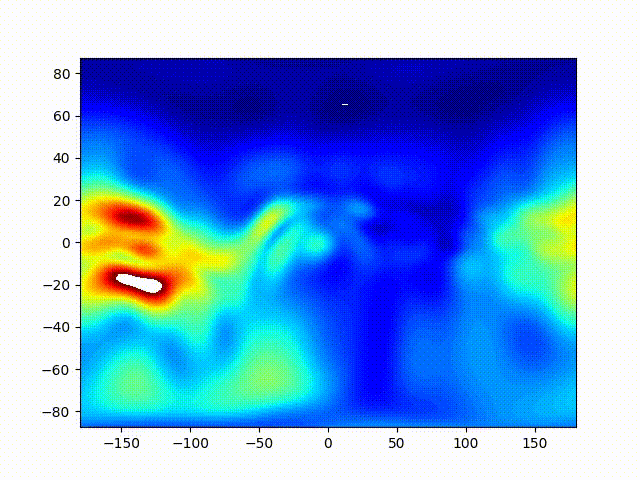

# MosGIM

Technique for Global Ionopsheric Maps. 



## Rules of road

Algorithm description is given in (cite if using code for your research): 

    Padokhin, A. M., E. S. Andreeva, M. O. Nazarenko, and S. A. Kalashnikova. "Phase-Difference Approach for GNSS Global Ionospheric Total Electron Content Mapping." Radiophysics and Quantum Electronics, 65(7): 481-495, 2023
    
Find full text paper [here](https://www.researchgate.net/profile/Artem-Padokhin/publication/370183741_Phase-Difference_Approach_for_GNSS_Global_Ionospheric_Total_Electron_Content_Mapping/links/64437a00d749e4340e2cb413/Phase-Difference-Approach-for-GNSS-Global-Ionospheric-Total-Electron-Content-Mapping.pdf)

## Prerequirements 

Code and launch were tested for Linux (Ubuntu) and [Anaconda](https://www.anaconda.com/download). Other operating systems should support calculation as well. Please modify Startup script for your needs. For Windows users, you may need install bash command support, to use script below (paths should be fixed nevertheless):

    conda install m2-base

## Install 

Create virtual environment using your favorite tool. Below is anaconda example: 

    conda create -n mosgim_service python=3.10
    conda deactivate 
    conda activate mosgim_service

Install `poetry`:

    pip install poetry 
    
Install `mosgim`, in project root run bash command:
    
    poetry install 

## Use test data

Test data are [here](https://cloud.iszf.irk.ru/index.php/s/AMynoe9RzCC3KD6)

## Run processing

Use `process.py` script in `scripts` folder:

    python process.py --data_path /PATH/TO/DATA/ --process_type single --data_source txt --date 2017-01-02 --ndays 1 --mag_type mdip --nworkers 7

* Unzip `2017_002.zip` from [data](https://cloud.iszf.irk.ru/index.php/s/AMynoe9RzCC3KD6) to `/PATH/TO/DATA/` 
* Adjust `nworkers` up to CPU cores you are able to use for computations.

## Startup script

Launch were tested for Linux (Ubuntu) and [Anaconda](https://www.anaconda.com/download):

```bash
wget "https://cloud.iszf.irk.ru/index.php/s/AMynoe9RzCC3KD6/download?path=%2F&files=2017_002.zip" -O /tmp/mosgim_data.zip --show-progress
mkdir /tmp/mosgim_data
cd /tmp/mosgim_data
unzip /tmp/mosgim_data.zip
cd /tmp/
conda create -y --name mosgim_service python=3.10
conda deactivate 
conda activate mosgim_service
pip install poetry 
git clone https://github.com/gnss-lab/mosgim.git
cd ./mosgim
poetry install 
cd ./scripts
python process.py --data_path /tmp/mosgim_data --process_type single --data_source txt --date 2017-01-02 --ndays 1 --mag_type mdip --nworkers 7

```
